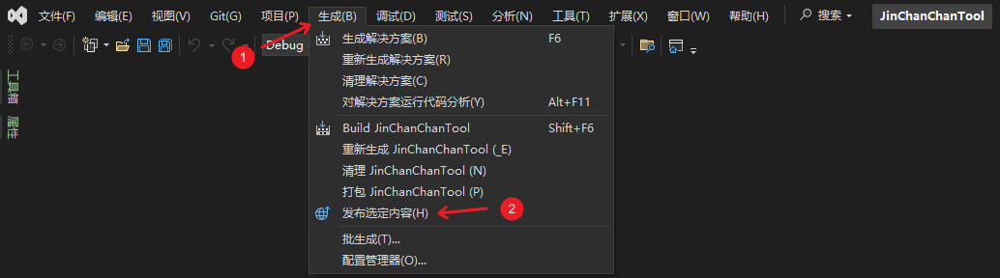
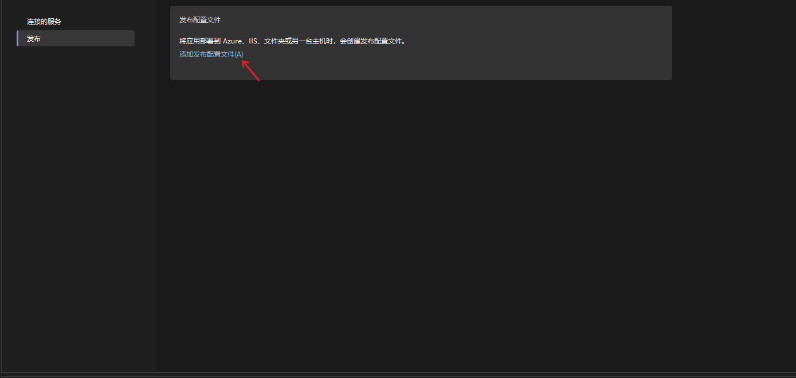
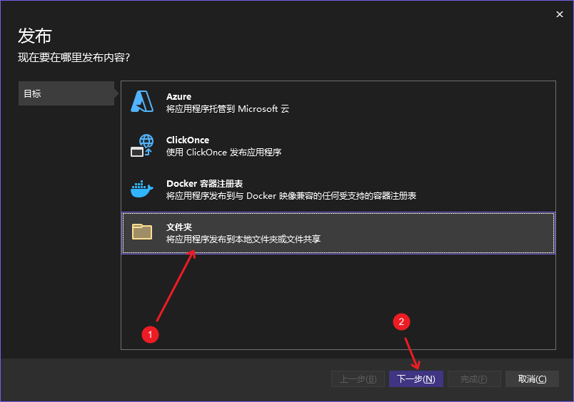
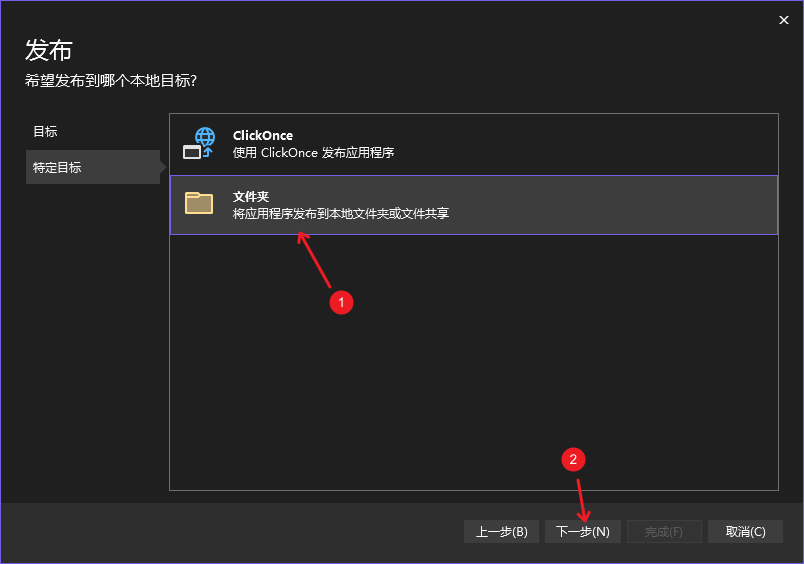
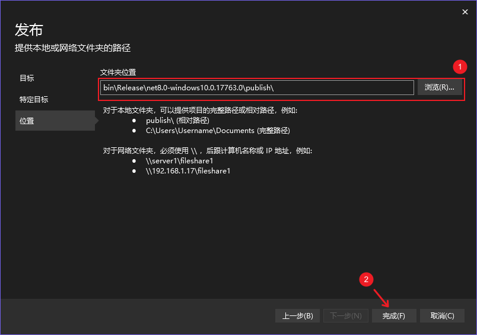
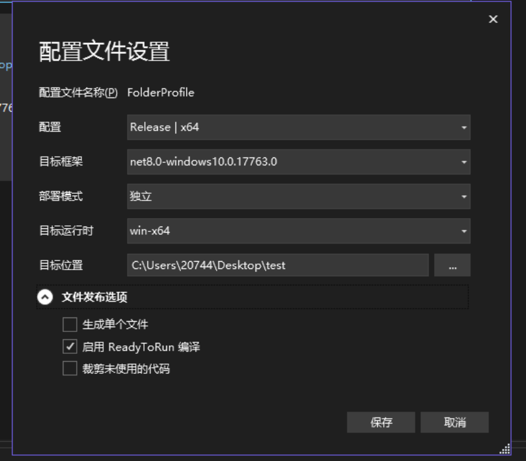
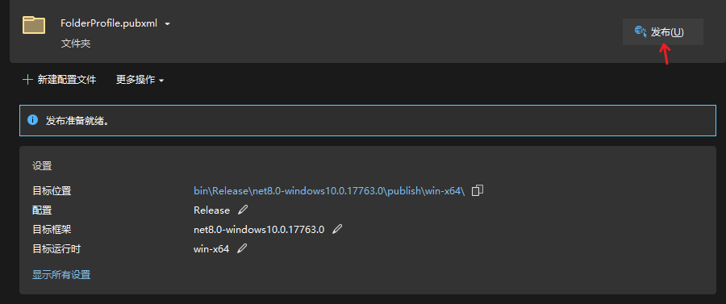
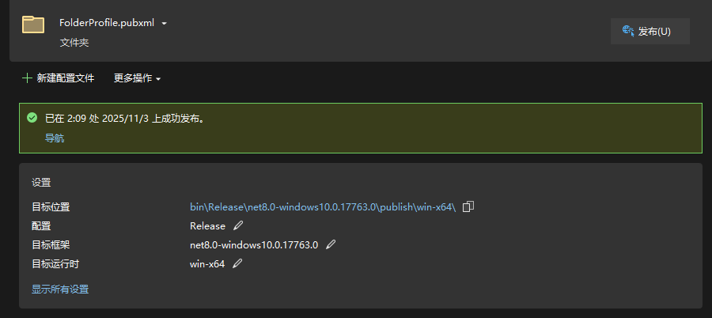
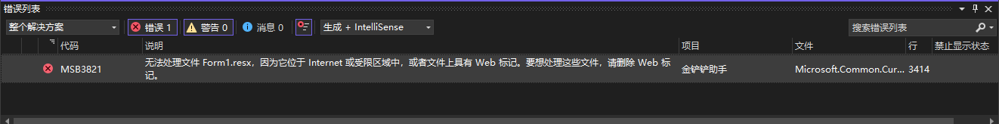
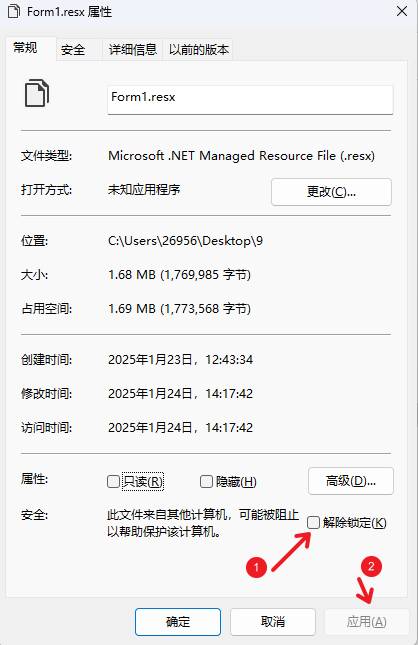

# 开发者文档

   1.1 [获取项目源码文件](#获取项目源码文件)

   1.2 [开发环境配置](#开发环境配置)

   1.3 [项目结构](#项目结构)

   1.4 [运行项目](#运行项目)

   1.5 [构建应用](#构建应用)

   1.6 [常见问题](#常见问题)

   1.7 [项目引用](#项目引用)


## 获取项目源码文件

### 方式1

1. 前往[Release 页面](https://github.com/XJYdemons/Jin-chan-chan-Tools/releases) 下载最新的源码`JinChanChanTool_vx.x.x_SourceCode.zip`。
2. 下载压缩包文件后，解压到一个目录中。

### 方式2

1. 项目-Code-DownLoad ZIP下载压缩包。
2. 解压后，源码文件存放于SourceCode文件夹中。


## 开发环境配置

* IDE：Visual Studio 2022
* 必需组件：
  * .NET 8.0 SDK
  * Windows SDK


## 项目结构

```
├── /JinChanChanTool                                    # 项目文件夹
	├── /bin                                            # 编译后的输出目录
	├── /obj                                            # 中间文件目录，包含编译时生成的临时文件
	├── /Properties                                     # 项目属性文件夹
		└── Resources.Designer.cs                       # 资源设计器生成代码
	├── /DataClass                                      # 数据模型类
		├── /StaticData                                 # 静态数据类
			├── ProgramVersion.cs                       # 程序版本单一来源（版本号、构建日期）
			├── JccCoordinateTemplates.cs               # 金铲铲位置坐标模版类
			├── JccLdCoordinateTemplates.cs             # 雷电模拟器坐标模版类
			├── LegacyTftCoordinateTemplates.cs         # 旧版云顶之弈坐标模版类
			└── TftCoordinateTemplates.cs               # 云顶之弈位置坐标模版类
		├── /GPUEnvironments                            # GPU环境相关数据类
			├── GpuInfo.cs                              # GPU信息类
			├── CudaInfo.cs                             # CUDA信息类
			└── RuntimeConfig.cs                        # 运行时配置类
		├── AutomaticSettings.cs                        # 自动应用配置数据类
		├── ManualSettings.cs                           # 用户应用配置数据类
		├── Hero.cs                                     # 英雄数据类
		├── Equipment.cs                                # 装备数据类
		├── LineUp.cs                                   # 阵容数据类（包含SubLineUp和LineUpUnit）
		├── RecommendedLineUp.cs                        # 推荐阵容数据类
		├── RecommendedEquipment.cs                     # 推荐装备数据类
		├── Profession.cs                               # 职业枚举类
		├── Peculiarity.cs                              # 特质枚举类
		├── MetatftLineupDtos.cs                        # 外部API数据传输对象类
		├── UpdateReleaseInfo.cs                        # GitHub 发布信息模型
		├── UpdateAssetInfo.cs                          # GitHub 发布资产模型
		├── UpdateCheckResult.cs                        # 更新检查结果模型
		├── UpdateApplyPlan.cs                          # 更新应用计划与文件条目模型
		├── UpdateResultRecord.cs                       # 更新结果记录模型
		└── ResultMapping.cs                            # OCR结果映射类
	├── /DIYComponents                                  # 自定义UI组件
		├── HeroPictureBox.cs                           # 英雄图片框（支持选中状态）
		├── HeroAndEquipmentPictureBox.cs               # 英雄与装备组合图片框
		├── HeroAndEquipmentPictureBox.Designer.cs      # 设计器生成代码
		├── EquipmentToolTip.cs                         # 装备提示框
		├── EquipmentInformationToolTip.cs              # 装备信息提示框
		├── BenchPanel.cs                               # 备战席面板
		├── HexagonBoard.cs                             # 六边形棋盘
		├── HexagonCell.cs                              # 六边形单元格
		├── CapsuleSwitch.cs                            # 胶囊开关组件
		├── CustomPanel.cs                              # 自定义面板
		├── CustomFlowLayoutPanel.cs                    # 自定义流式布局面板
		└── RoundedButton.cs                            # 圆角按钮
	├── /Forms                                          # 窗体类
		├── /NecessaryForm                              # 核心窗体
			├── MainForm.cs                             # 主窗口
			├── MainForm.Designer.cs                    # 主窗口设计器代码
			├── SettingForm.cs                          # 设置窗口
			├── SettingForm.Designer.cs                 # 设置窗口设计器代码
			├── SetupWizardForm.cs                      # 首次运行设置向导
			├── SetupWizardForm.Designer.cs             # 设置向导设计器代码
			├── AboutForm.cs                            # 关于窗口
			└── AboutForm.Designer.cs                   # 关于窗口设计器代码
		├── /DisplayUIForm                              # 显示与覆盖窗体
			├── LineUpForm.cs                           # 阵容展示窗口
			├── LineUpForm.Designer.cs                  # 阵容展示窗口设计器代码
			├── LineUpSelectForm.cs                     # 阵容选择窗口
			├── LineUpSelectForm.Designer.cs            # 阵容选择窗口设计器代码
			├── EquipmentForm.cs                        # 装备推荐窗口
			├── EquipmentForm.Designer.cs               # 装备推荐窗口设计器代码
			├── CardHighlightOverlayForm.cs             # 卡牌高亮覆盖窗口
			├── CardHighlightOverlayForm.Designer.cs    # 卡牌高亮覆盖窗口设计器代码
			├── StatusOverlayForm.cs                    # 状态覆盖窗口
			├── StatusOverlayForm.Designer.cs           # 状态覆盖窗口设计器代码
			├── OutputForm.cs                           # 调试输出窗口
			├── OutputForm.Designer.cs                  # 调试输出窗口设计器代码
			├── SelectForm.cs                           # 通用选择窗口
			└── SelectForm.Designer.cs                  # 通用选择窗口设计器代码
		├── /ToolForm                                   # 工具与编辑器窗体
			├── HeroInfoEditorForm.cs                   # 英雄数据编辑器
			├── HeroInfoEditorForm.Designer.cs          # 英雄数据编辑器设计器代码
			├── EquipmentDataEditorForm.cs              # 装备数据编辑器
			├── EquipmentDataEditorForm.Designer.cs     # 装备数据编辑器设计器代码
			├── CorrectionEditorForm.cs                 # OCR纠正编辑器
			├── CorrectionEditorForm.Designer.cs        # OCR纠正编辑器设计器代码
			├── ProcessSelectorForm.cs                  # 进程选择窗口
			└── ProcessSelectorForm.Designer.cs         # 进程选择窗口设计器代码
		├── ProgressForm.cs                             # 进度条窗口
		└── ProgressForm.Designer.cs                    # 进度条窗口设计器代码
	├── /Services                                       # 业务逻辑服务类
		├── /DataServices                               # 数据管理服务
			├── /Interface                              # 服务接口
				├── IHeroDataService.cs                 # 英雄数据服务接口
				├── IEquipmentService.cs                # 装备数据服务接口
				├── ILineUpService.cs                   # 阵容数据服务接口
				├── IRecommendedLineUpService.cs        # 推荐阵容服务接口
				├── IManualSettingsService.cs           # 用户配置服务接口
				├── IAutomaticSettingsService.cs        # 自动配置服务接口
				└── ICorrectionService.cs               # OCR纠正服务接口
			├── HeroDataService.cs                      # 英雄数据服务类
			├── EquipmentService.cs                     # 装备数据服务类
			├── LineUpService.cs                        # 阵容数据服务类
			├── RecommendedLineUpService.cs             # 推荐阵容服务类
			├── ManualSettingsService.cs                # 用户配置服务类
			├── AutomaticSettingsService.cs             # 自动配置服务类
			└── CorrectionService.cs                    # OCR纠正服务类
		├── /AutomaticSetCoordinates                    # 自动坐标设置服务
			├── AutomationService.cs                    # 自动化编排服务类
			├── CoordinateCalculationService.cs         # 坐标计算服务类
			├── ProcessDiscoveryService.cs              # 进程发现服务类
			└── WindowInteractionService.cs             # 窗口交互服务类
		├── /ManuallySetCoordinates                     # 手动坐标设置服务
			└── FastSettingPositionService.cs           # 快速坐标设置服务类
		├── /RecommendedEquipment                       # 装备推荐服务
			├── /Interface                              # 服务接口
				└── IHeroEquipmentDataService.cs        # 英雄装备数据服务接口
			├── HeroEquipmentDataService.cs             # 英雄装备数据服务类
			├── CrawlingService.cs                      # 爬虫服务类
			├── DynamicGameDataService.cs               # 动态游戏数据服务类
			├── TranslationModels.cs                    # 翻译模型类
			└── UnitDetailModels.cs                     # 单位详情模型类
		├── /LineupCrawling                             # 阵容爬取服务
			└── LineupCrawlingService.cs                # 阵容爬取服务类
		├── /Network                                    # 网络通信服务
			├── HttpProvider.cs                         # HTTP客户端提供者
			└── SignatureHelper.cs                      # 请求签名助手
		├── /GPUEnvironments                            # GPU环境服务
			├── GpuDetectionService.cs                  # GPU检测服务类
			├── CudaDetectionService.cs                 # CUDA检测服务类
			├── CudaInstallerService.cs                 # CUDA安装服务类
			├── CudnnInstallerService.cs                # cuDNN安装服务类
			├── RuntimeDeployService.cs                 # 运行时部署服务类
			└── DownloadService.cs                      # 下载服务类
		├── /Update                                     # 程序本体更新服务
			├── /Interface                              # 服务接口
				└── IProgramUpdateService.cs            # 程序更新服务接口
			├── ProgramUpdateService.cs                 # 更新编排服务类（检查、下载、暂存、启动更新进程）
			├── GitHubReleaseClient.cs                  # GitHub 发布信息客户端
			├── UpdatePackageExtractor.cs               # 更新包解压、差异清单与默认值快照
			├── UpdateApplier.cs                        # 更新应用器（独立进程执行替换与回滚）
			├── UpdatePathPolicy.cs                     # 用户态文件保护清单与路径安全校验
			├── ConfigurationMigrationService.cs        # 配置增量合并服务类
			├── ConfigurationMigrationResult.cs         # 配置增量合并结果
			├── UpdateConstants.cs                      # 更新流程共用常量
			└── UpdateMessages.cs                       # 更新流程固定文案
		├── CardService.cs                              # 卡牌自动化服务类（拿牌、高亮、刷新）
		├── QueuedOCRService.cs                         # 队列OCR服务类（支持CPU/GPU）
		└── UIBuilderService.cs                         # UI构建服务类
	├── /Tools                                          # 工具类
		├── /KeyBoardTools                              # 键盘工具
			├── GlobalHotkeyTool.cs                     # 全局热键工具类
			└── KeyboardControlTool.cs                  # 键盘控制工具类
		├── /MouseTools                                 # 鼠标工具
			├── MouseControlTool.cs                     # 鼠标控制工具类
			├── MouseHookTool.cs                        # 鼠标钩子工具类
			└── MousePositionTool.cs                    # 鼠标位置工具类
		├── /LineUpCodeTools                            # 阵容码工具
			└── LineUpParser.cs                         # 阵容码解析器
		├── LogTool.cs                                  # 日志工具类
		├── ImageProcessingTool.cs                      # 图像处理工具类
		├── DragHelper.cs                               # 拖拽助手类
		└── ColorJsonConverter.cs                       # 颜色JSON转换器
	├── /Resources                                      # 资源目录
		├── /HeroDatas                                  # 游戏数据目录
			├── /强音对决                               # 金铲铲游戏模式数据
				├── HeroData.json                       # 英雄数据
				├── LineUps.json                        # 阵容模板
				└── /images                             # 英雄头像图片
			└── /英雄联盟传奇                           # 云顶之弈游戏模式数据
				├── HeroData.json                       # 英雄数据
				├── Equipment.json                      # 装备数据
				├── EquipmentData.json                  # 装备详情数据
				├── LineUps.json                        # 阵容模板
				├── RecommendedLineUps.json             # 推荐阵容
				├── /images                             # 英雄头像图片
				└── /EquipmentImages                    # 装备图标图片
		├── /Models                                     # OCR模型目录
			├── /PP-OCRv5_mobile_det_infer              # 文本检测模型
			├── /PP-OCRv5_mobile_rec_infer              # 文本识别模型
			└── ppocr_keys_v5.txt                       # OCR字符字典
		├── CorrectionsList.json                        # OCR结果纠正映射文件
		├── DownloadSources.json                        # 运行时下载源配置文件
		├── UpdateSources.json                          # 程序更新源与用户态文件保护清单
		├── defaultHeroIcon.png                         # 默认英雄图标
		└── icon.ico                                    # 应用程序图标
	├── app.manifest                                    # 应用配置清单文件
	├── JinChanChanTool.csproj                          # 项目文件
	├── JinChanChanTool.csproj.user                     # 用户特定的项目配置文件
	└── Program.cs                                      # 应用程序入口点
└── JinChanChanTool.sln                                 # 解决方案文件，可通过VisualStudio打开
```

## 项目架构说明

### 核心功能模块

#### 1. OCR识别系统
- **引擎**: PaddleOCR v5
- **支持模式**: CPU推理 / GPU推理（CUDA加速）
- **功能**: 识别游戏内英雄卡牌名称
- **优化**: 队列化处理、结果纠正映射

#### 2. 自动化系统
- **卡牌拾取**: 基于OCR识别结果自动点击目标英雄
- **商店刷新**: 自动刷新商店并重新识别
- **高亮显示**: 覆盖窗口高亮推荐英雄
- **状态反馈**: 实时显示自动化状态

#### 3. 数据管理系统
- **多赛季支持**: 支持不同游戏赛季的数据切换
- **英雄数据**: 英雄名称、费用、职业、特质、图标
- **装备数据**: 装备名称、类型、合成路径、图标
- **阵容数据**: 早期/中期/后期阵容变体、装备推荐
- **推荐系统**: 从外部API获取推荐阵容和装备

#### 4. 坐标系统
- **自动检测**: 自动识别游戏窗口并计算坐标
- **手动设置**: 支持手动快速设置关键坐标
- **模板系统**: 预设坐标模板（金铲铲/云顶之弈）

#### 5. GPU加速支持
- **GPU检测**: 自动检测NVIDIA GPU和CUDA支持
- **运行时部署**: 自动下载和部署CUDA/cuDNN运行时
- **性能优化**: GPU推理显著提升OCR识别速度

#### 6. 程序本体更新系统
- **版本单一来源**: 版本号只来自项目文件 `<Version>`，运行时由 `ProgramVersion` 从程序集元数据读取
- **预发布隔离**: 只有正式版参与自动更新；预发布版（`-beta` 等）自身不检查更新，正式版用户也不会被推送预发布标签
- **更新检查**: `GitHubReleaseClient` 读取 `Resources/UpdateSources.json`，按配置的镜像列表依次请求 GitHub Releases API
- **下载与校验**: 复用 `DownloadService` 的多源测速与断点续传，并校验资产大小与 SHA256
- **差异更新**: `UpdatePackageExtractor` 将更新包解压后与安装目录逐文件比对，只替换内容真正变化的文件
- **自替换**: 主程序退出后由 `UpdateApplier` 在独立进程（`--apply-update`）中完成替换；覆盖运行中的映像采用“旧文件重命名为 .old → 写入新文件”的方式
- **失败回滚**: 任一文件替换失败即整批回滚，保证安装目录不会停留在半更新状态
- **配置增量合并**: `ConfigurationMigrationService` 只把新版本新增的设置项与数据条目补进用户文件，已有内容保持不变，合并前自动备份

#### 7. 更新相关的用户态文件保护
更新时下列文件永不覆盖，仅做字段级增量合并：

| 文件 | 说明 |
|------|------|
| `Resources/ManualSettings.json` | 用户应用设置 |
| `Resources/AutomaticSettings.json` | 自动应用设置 |
| `Resources/CorrectionsList.json` | OCR结果纠正列表 |
| `Resources/HeroDatas/{赛季}/LineUps.json` | 用户阵容 |
| `Resources/HeroDatas/{赛季}/EquipmentData.json` | 推荐装备数据 |
| `Resources/HeroDatas/{赛季}/RecommendedLineUps.json` | 推荐阵容数据 |
| `Resources/HeroDatas/{赛季}/LineUpCodeDictionary.json` | 阵容码字典 |
| `Logs/`、`Downloads/` | 运行日志与下载缓存目录 |

保护清单在 `Resources/UpdateSources.json` 的 `UpdatePolicy` 节点中配置。
`UpdatePathPolicy` 会把配置清单与代码内置的 `DefaultUserStateFiles` / `DefaultUserStateDirectories`
**合并**（并集去重），因此上表是两者的合计结果——例如 `CorrectionsList.json` 只在内置清单中，
即使配置文件未列出它，也依然受保护。

配置项的路径支持两种通配：`{season}` 匹配单个目录段，`**` 匹配剩余任意层级。

### 设计模式

- **依赖注入**: 服务通过构造函数注入到窗体
- **服务层模式**: 业务逻辑与UI分离
- **接口抽象**: 服务实现接口以支持扩展
- **单例模式**: 部分服务（如OutputForm）使用单例
- **观察者模式**: 基于事件的状态更新

### 数据流程

1. **启动流程**:
   ```
   Program.cs → 初始化服务 → 首次运行向导（可选）→ 主窗口
   ```

2. **OCR识别流程**:
   ```
   截图 → QueuedOCRService → PaddleOCR → 结果纠正 → 返回识别结果
   ```

3. **自动拾取流程**:
   ```
   热键触发 → CardService → OCR识别 → 匹配阵容 → 模拟点击
   ```

4. **数据加载流程**:
   ```
   选择赛季 → 加载对应JSON文件 → 反序列化为数据对象 → 更新UI
   ```

5. **程序更新流程**:
   ```
   检查更新（GitHub Releases API，预发布拦截）→ 用户确认
   → 检查磁盘空间 → 下载更新包（多源+断点续传）
   → 校验大小与SHA256 → 解压到 staging → 校验解压结果未越界
   → 抽取用户态文件默认值快照 → 与安装目录比对生成差异清单
   → 过滤越界路径 → 写出计划文件 → 启动 --apply-update 进程
   → 主程序退出 → 等待父进程退出 → 备份 → 逐个替换（失败即整批回滚）
   → 重启主程序 → 下次启动时执行配置增量合并并清理残留
   ```

   注意顺序：**先抽取用户态文件默认值快照，再生成差异清单**。快照目录位于
   `%LocalAppData%\JinChanChanTool\Update\Defaults\`（在下载目录之外），
   因此更新成功后的清理不会误删快照。

### 版本号维护

#### 唯一输入口

版本号只有一个来源：`SourceCode/JinChanChanTool/JinChanChanTool.csproj` 中的 `<Version>`。
其余属性由它推导，**不要单独修改**：

```xml
<Version>7.7.0</Version>
<VersionPrefix Condition="'$(VersionPrefix)' == ''">$(Version.Split('-')[0])</VersionPrefix>
<FileVersion>$(VersionPrefix).0</FileVersion>
<AssemblyVersion>$(VersionPrefix).0</AssemblyVersion>
```

推导关系：

| 属性 | 来源 | 示例（`<Version>7.8.0-beta</Version>`） |
|------|------|------------------------------------------|
| `VersionPrefix` | 剥掉 `-` 及其之后的内容 | `7.8.0` |
| `FileVersion` | `$(VersionPrefix).0` | `7.8.0.0` |
| `AssemblyVersion` | `$(VersionPrefix).0` | `7.8.0.0` |
| `InformationalVersion` | 原始 `<Version>`，**保留后缀** | `7.8.0-beta` |

程序集版本必须是纯数字，否则编译报错 `CS7034`；因此必须保留 `VersionPrefix` 剥离。

#### 运行时读取

`ProgramVersion`（`DataClass/StaticData/ProgramVersion.cs`）从程序集元数据读取，提供：

| 成员 | 说明 | `7.8.0-beta` 的取值 |
|------|------|---------------------|
| `RawVersionText` | 原始文本，**用于界面展示** | `7.8.0-beta` |
| `VersionText` | 纯数字，用于比较与标签拼接 | `7.8.0` |
| `IsPrerelease` | 是否为预发布版本 | `true` |
| `TagText` | 带 v 前缀的标签 | `v7.8.0` |
| `BuildDateText` | 构建日期 | `2026.09.27` |
| `DisplayText` | 展示文本 | `7.8.0-beta(2026.09.27)` |

关于窗口通过本地化键 `AboutForm.Label.版本格式`（`版本  v{0}({1})`）填充
`RawVersionText` 与 `BuildDateText`，做到“填什么显示什么”。

`ContainsPrereleaseSuffix()` 仅以 `-` 判定预发布：`+` 之后属于构建元数据，
不算预发布（如 `7.8.0+abc` 返回 `false`）。

#### 预发布版本规则

只有正式版参与自动更新，`ProgramUpdateService.CheckForUpdateAsync` 有两道闸门：

1. **当前程序为预发布版** → 直接返回，不发起任何网络请求；
2. **远端标签为预发布**（如 `v7.8.0-beta`）→ 跳过，正式版用户不会被推向测试版。

因此预发布版用户不会收到任何自动更新提示，需手动下载正式版。

#### 发布流程

**发布正式版：**

1. 修改 `JinChanChanTool.csproj` 的 `<Version>`（如 `7.8.0`）。
2. 在 `Documents/更新记录.md` 中补充对应版本的更新说明。
3. 以 `v7.8.0` 打 tag，并上传名为 `JinChanChanTool_v7.8.0_Windows_x64.zip` 的发布资产
   （更新包需为“解压即覆盖安装目录”的结构）。

**发布测试版：**

1. 修改 `<Version>` 为带后缀的形式（如 `7.8.0-beta`）。
2. 以相同文本打 tag：`v7.8.0-beta`。**标签必须带后缀**，否则会被当作正式版推送给所有用户。
3. 更新包命名沿用同一规则：`JinChanChanTool_v7.8.0-beta_Windows_x64.zip`。

> 注意：更新包文件名需匹配 `UpdateSources.json` 中的 `PackageNamePattern`
> （当前为 `^JinChanChanTool_v(?<version>[0-9]+\.[0-9]+\.[0-9]+)_Windows_x64\.zip$`）。
> 该正则只接受三段数字版本，**测试版资产无法被匹配**，如需分发测试版更新包需同步放宽该正则。

## 技术栈

### 开发环境
- **IDE**: Visual Studio 2022
- **框架**: .NET 8.0 (Windows 10.0.17763.0+)
- **平台**: Windows x64
- **UI框架**: WinForms

### 主要依赖包
- **Newtonsoft.Json** (13.0.3) - JSON序列化/反序列化
- **OpenCvSharp4** (4.11.0) - 图像处理
- **Sdcb.PaddleInference** (3.0.1) - OCR推理引擎
- **Sdcb.PaddleOCR** (3.0.1) - OCR封装库
- **System.Drawing.Common** (9.0.9) - 图形绘制
- **System.Management** (9.0.0) - 进程管理

### OCR模型
- **检测模型**: PP-OCRv5_mobile_det_infer
- **识别模型**: PP-OCRv5_mobile_rec_infer
- **字符字典**: ppocr_keys_v5.txt

## 运行项目

1. 使用 Visual Studio 打开` JinChanChanTool.sln `文件。

2. 选择`Debug-X64`模式，如图：


3. 点击运行，如图：

    

## 构建应用

1. 使用 Visual Studio 打开`JinChanChanTool.sln` 文件。
2. 菜单项-生成-发布选定内容



3. 点击**添加发布配置文件**



4. 选择“文件夹”，下一步



5. 选择“文件夹”，下一步

   

6. 选择发布路径，点击完成。



7. 点击“显示所有设置”，将设置项修改为与下图一致：
   * 配置：Release|x64
   * 目标框架：net8.0-windows10.0.17763.0
   * 部署模式：独立
   * 目标运行时：win-x64
   * 目标位置：自定义发布位置
   * 生成单个文件❎
   * 启用ReadyToRun编译✅
   * 裁剪未使用的代码❎

   

8. 点击“发布”按钮。

   

9. 关注提示信息，若发布成功，会提示成功发布。

   

## 常见问题

**问题1：** 运行或生成解决方案时报错：无法处理文件 Form1.resx，因为它位于 Internet 或受限区域中，或者文件上具有 Web 标记。要想处理这些文件，请删除 Web 标记。如图：



**解决：**

1. 先关闭VisualStudio。
2. 来到项目根目录，找到文件“Form1.resx”，右键菜单-属性。
3. 在下方“安全”-“此文件来自其他计算机，可能被阻止以帮助保护该计算机”处，勾选“解除锁定”，并点击应用按钮。如图：



4. 再次用VisualStudio打开`JinChanChanTool.sln`文件。


## 项目引用

### OCR相关
* [Paddle OCR Sharp](https://github.com/raoyutian/PaddleOCRSharp) - PaddleOCR的C#封装
* [PaddleSharp](https://github.com/sdcb/PaddleSharp) - Paddle推理引擎的.NET封装

### 图像处理
* [OpenCvSharp](https://github.com/shimat/opencvsharp) - OpenCV的.NET封装

### 其他依赖
* [Newtonsoft.Json](https://www.newtonsoft.com/json) - JSON处理库

## 开发指南

### 添加新赛季数据

1. 在 `Resources/HeroDatas/` 下创建新赛季文件夹
2. 添加以下文件:
   - `HeroData.json` - 英雄数据
   - `Equipment.json` / `EquipmentData.json` - 装备数据
   - `LineUps.json` - 阵容模板
   - `RecommendedLineUps.json` - 推荐阵容
   - `images/` - 英雄头像图片文件夹
   - `EquipmentImages/` - 装备图标图片文件夹

### 添加新的自定义组件

1. 在 `DIYComponents/` 文件夹下创建新的类文件
2. 继承自相应的WinForms控件基类
3. 重写 `OnPaint` 方法实现自定义绘制
4. 在 `MainForm` 或其他窗体中使用

### 添加新的服务

1. 在 `Services/` 对应子文件夹下创建服务类
2. 在 `Services/*/Interface/` 下创建对应接口
3. 在 `Program.cs` 中注册服务实例
4. 通过构造函数注入到需要使用的窗体

### 更新流程的调试技巧

1. **手动触发检查**: 主窗口菜单“帮助-检查更新”。
2. **查看更新日志**: `%LocalAppData%\JinChanChanTool\Update\Logs\updater_yyyyMMdd.log`（更新进程独立日志）。
3. **查看更新结果**: 同目录下的 `update_result_{版本}_{时间}.json`。
4. **离线验证替换与回滚**: 手工构造计划文件后执行
   `JinChanChanTool.exe --apply-update "{计划文件路径}"`。
5. **查看待应用计划**: `%LocalAppData%\JinChanChanTool\Update\pending_update.json`。

### 调试技巧

1. **查看OCR识别结果**: 使用 `OutputForm` 查看实时日志
2. **测试坐标设置**: 使用手动设置模式验证坐标准确性
3. **GPU调试**: 检查 `AutomaticSettings.json` 中的GPU配置
4. **数据验证**: 使用内置的数据编辑器验证JSON数据格式

### 代码规范

- 使用中文注释说明关键逻辑
- 服务类使用依赖注入模式
- 数据类使用属性而非字段
- 异步操作使用 `async/await` 模式
- 资源释放实现 `IDisposable` 接口

