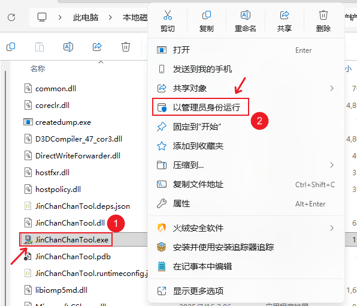
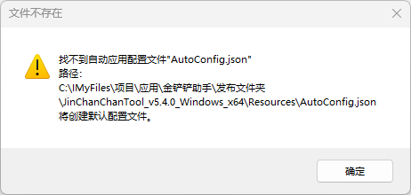
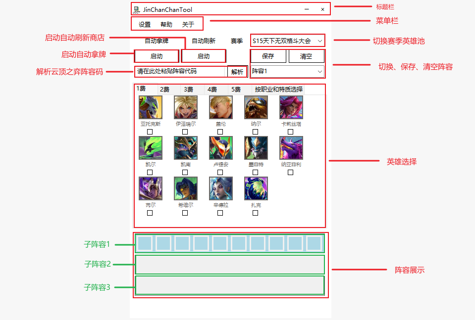
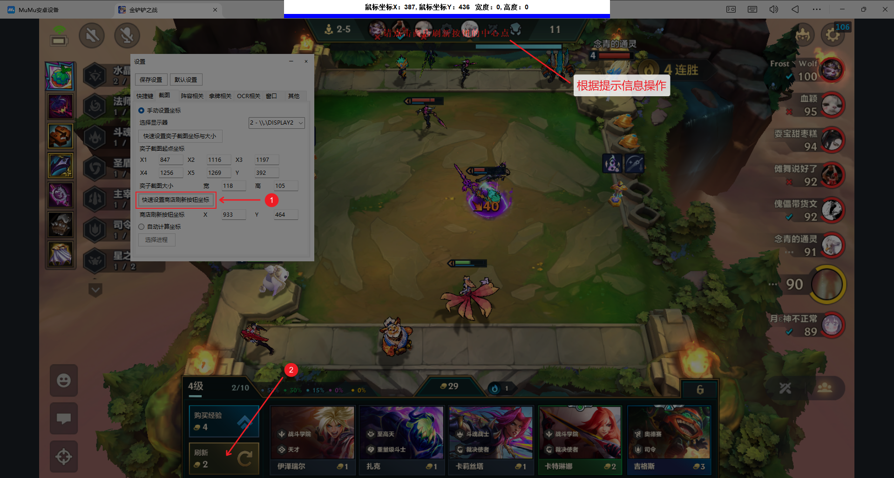
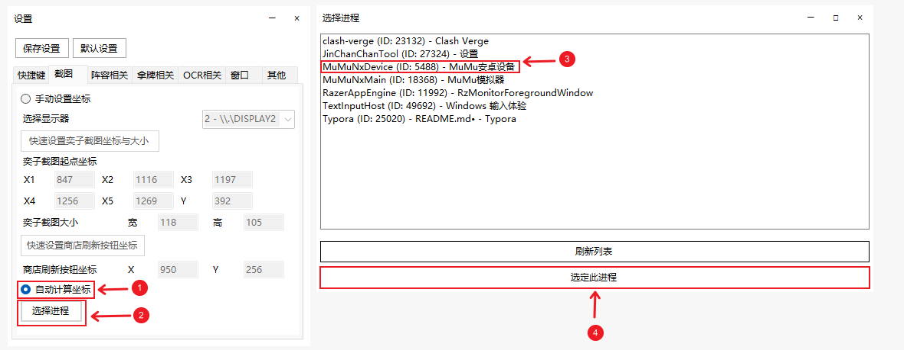
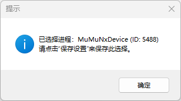

> 感谢你的Star，提需求、报BUG，最好能在拉Issues的同时，进QQ群954285837陈述详细内容。

> [!WARNING]
>
> 需要使用GPU推理OCR功能，请参阅[使用GPU推理OCR.md](https://github.com/XJYdemons/JinChanChanTool/blob/main/%E4%BD%BF%E7%94%A8GPU%E6%8E%A8%E7%90%86OCR.md)。

# Jin Chan Chan Tool

适用于“模拟器运行的金铲铲之战”与“云顶之奕”的自动化拿牌、刷新商店的工具。

## 目录

1. [简介](#简介)

2. [功能特点](#功能特点)

3. [安装](#安装)

   3.1 [系统要求](#系统要求)

   3.2 [安装步骤](#安装步骤)

4. [使用](#使用)

   4.1 [首次使用](#首次使用)

   4.2 [用户自定义英雄卡池](#用户自定义赛季英雄卡池)

5. [其他链接](#其他链接)
6. [问题](#问题)

### 简介

* 程序的用途：本程序可帮助用户在进行金铲铲/云顶之奕对局时快速精确的拿牌、D牌，实现拿牌自动化。
* 目标用户：金铲铲之战模拟器玩家、云顶之奕玩家
* 程序实现原理：
  * 自动拿牌：通过截取目标图片，处理后再进行OCR（光学字符识别）的方式转化为文本，通过文本对比判断是否为目标卡牌。如果是目标卡牌，则模拟鼠标或键盘进行拿牌操作。
  * 自动刷新商店：通过模拟鼠标或键盘刷新商店。

### 功能特点：

* 快捷设置游戏内的截图位置：无需用户手动测量输入游戏内牌库位置、商店刷新按钮位置，提供快速设置功能。
* 自动拿牌：开启该功能后，用户勾选好需要的奕子后，将自动拿取。
* 自动刷新商店：开启该功能后，当前商店没有目标奕子时，会自动刷新商店，配合自动拿牌使用。
* 长按快捷键自动D牌：长按用户自定义的快捷键可以自动拿牌并刷新商店，用户松开按键后即停止。
* 适配多显示器、任意DPI（缩放方式）、任意分辨率：对于多显示器用户，本项目在启动时将会检测用户已连接显示器，并加载到下拉框供用户选择。
* 系统级全局快捷键：对于自动拿牌、自动刷新商店、召出/隐藏窗口，提供系统级全局快捷键快捷键功能，保证在游戏内不会被拦截，并可以手动修改快捷键。
* 程序默认窗口置顶并可以通过快捷键隐藏/召出，因此在游戏中无需切屏就可使用各项功能。
* 批量选择英雄：支持根据职业或特质一键批量选择英雄。
* 每个阵容都配有三套子阵容槽位，方便灵活变阵。
* 阵容自定义：支持阵容的保存、命名、数量调整、容量调整。
* 提供英雄配置文件编辑器，支持用户自定义英雄数据，如英雄头像、英雄名称、费用、职业、特质等：
   * 该功能用途之一是能支持用户自行更新赛季英雄。
   * 该功能用途之二是能支持用户根据所处地区客户端语言进行本地化支持。
   * 该功能用途之三是能支持用户自定义英雄头像。
* 自动停止拿牌与刷新商店：当多次尝试拿牌或刷新商店失败后，将自动停止，避免无效操作。
* 切换赛季英雄池：可在程序内切换赛季英雄池，无需分发多个版本。
* 阵容码解析：支持解析云顶之弈的阵容码（金铲铲之战阵容码密钥动态变化，因此无法解析）。
* 可选的拿牌方式：可选择模拟鼠标移动点击拿牌或者按键拿牌。
* 可选的刷新商店方式：可选择模拟鼠标移动点击刷新商店或者按键刷新商店。
* 可选择推理设备：可选择CPU或GPU推理。
* 英雄装备推荐：将鼠标放置在英雄选择器的英雄头像上时，会弹出推荐装备。

### 安装：

#### 系统要求

* 操作系统：Windows10或更高版本
* 内存：4GB或以上
* 硬盘空间：1GB或以上
#### 安装步骤
1. 前往[Release 页面](https://github.com/XJYdemons/JinChanChanTool/releases) 下载最新的安装包"JinChanChanTool_vx.x.x_Windows_x64.zip"。
2. 下载压缩包文件后，解压到一个目录中。
3. 以**管理员身份**运行`金铲铲助手.exe`。

### 使用：

#### 首次使用



以**管理员身份运行**`JinChanChanTool.exe`,程序运行后会检查是否存在用户设置文件、应用缓存文件、阵容文件，由于是第一次运行，因此上述三者都不存在，因此会连续弹出三次对话框提示用户确认。





在全部确认后，会弹出是否更新推荐装备数据的弹窗，点“是”即可。


装备数据更新完成后，会弹窗提示重启程序，点确定即可。


至此，首次打开程序的初始化工作便结束了。完成初始化工作后，便来到了程序的主界面：



程序是通过截图并识别来获取到游戏内商店5个卡槽的卡牌信息的，因此程序需要设置截图位置，程序提供两种设置截图位置的方法：一种是**手动设置坐标**，另一种是**自动计算坐标**。

通过菜单栏-设置打开设置窗口，选中**截图**选项卡，即可进行截图坐标设置。

**手动设置坐标**

1. 勾选单选框“手动设置坐标”。

2. 打开显示器下拉框，选择目标游戏进程所在的显示器（单显示器用户忽略该步骤）


3. 打开游戏，进入对局

* 点击-“快速设置奕子截图坐标与大小”，分别框选商店从左到右的5个奕子名称（需要将奕子名称行用矩形包裹，但不要包裹奕子价格）


* 点击-“快速设置商店刷新按钮坐标”，将鼠标放置到用于刷新商店的按钮上，单击鼠标左键即可设置成功。



**自动计算坐标**

1. 勾选单选框“自动计算坐标”。
2. 点击“选择进程”按钮，打开“选择进程”窗口。
3. 选择目标游戏进程，并点击按钮“选定此进程”



4. 弹出弹窗，提示保存设置。

   

   无论是手动设置坐标还是自动计算坐标，设置完后都请点击设置窗口顶部的“保存设置”按钮来保存设置。

#### 用户自定义赛季英雄卡池

> 此功能可供用户自行更新、其他模式英雄池（例如福星）以及解决非中文使用地区的英雄名称差异问题。
##### 第一步：配置英雄信息

1. 在软件根目录（软件的安装目录）下，找到Resources文件夹，HeroDatas文件夹，该文件夹下的每一个文件夹对应一个赛季英雄池，每个赛季英雄池文件夹内都应该有一个HeroData.json英雄数据文件以及一个英雄头像图片文件夹images（存放与HeroData.json文件内英雄同名的.png文件），使用程序自带的英雄配置文件编辑器（设置-阵容相关-英雄配置文件编辑器）可编辑该文件：


2. 该文件结构是以一对`[]`包裹数个英雄数据结构，每个英雄数据的格式都严格遵循`{"HeroName": "英雄名字","Cost": 英雄费用,"Profession": "职业1|职业2","Peculiarity": "特质1|特质2"}`，在前一个英雄数据结构后增加一个需要先加一个英文逗号`,`.(若已是文件中最后一个英雄数据结构则无需加逗号)
```
[
  {
    "HeroName": "亚托克斯",
    "Cost": 1,
    "Profession": "主宰|重量级斗士",
    "Peculiarity": "超级战队"
  },
  {
    "HeroName": "伊泽瑞尔",
    "Cost": 1,
    "Profession": "天才",
    "Peculiarity": "战斗学院"
  },
  {
    "HeroName": "迦娜",
    "Cost": 2,
    "Profession": "司令|圣盾使",
    "Peculiarity": "水晶玫瑰"
  },
  {
    "HeroName": "烬",
    "Cost": 2,
    "Profession": "狙神",
    "Peculiarity": "至高天"
  },
  {
    "HeroName": "阿狸",
    "Cost": 3,
    "Profession": "法师",
    "Peculiarity": "星之守护者"
  },
  {
    "HeroName": "沃利贝尔",
    "Cost": 4,
    "Profession": "刀锋领主",
    "Peculiarity": "假面摔角手"
  },
  {
    "HeroName": "悠米",
    "Cost": 4,
    "Profession": "天才",
    "Peculiarity": "战斗学院"
  },
  {
    "HeroName": "布隆",
    "Cost": 5,
    "Profession": "护卫",
    "Peculiarity": "魄罗之心|假面摔角手"
  },
  {
    "HeroName": "格温",
    "Cost": 5,
    "Profession": "法师",
    "Peculiarity": "斗魂战士"
  }
]
```
##### 第二步：配置英雄头像

在英雄配置文件对应的images文件夹中，确保HeroData.json文件中的每一个英雄项都有对应的同名.png格式图片

举例：

假设Herodata.json中有三个英雄结构:

分别是

```
{
    "HeroName": "亚托克斯",
    "Cost": 1,
    "Profession": "主宰|重量级斗士",
    "Peculiarity": "超级战队"
  },
  {
    "HeroName": "伊泽瑞尔",
    "Cost": 1,
    "Profession": "天才",
    "Peculiarity": "战斗学院"
  },
  {
    "HeroName": "迦娜",
    "Cost": 2,
    "Profession": "司令|圣盾使",
    "Peculiarity": "水晶玫瑰"
  }
```

那么在images文件夹中就应该存在三个英雄头像图片文件`亚托克斯.png`、`伊泽瑞尔.png`、`迦娜.png`.

### 其他链接

* 备用下载链接：https://pan.baidu.com/s/1fn-D8b7r7aC8Hb0Ka7wpaQ?pwd=k7mk

### 问题

**问题1：** 无法拿牌、快捷键失效等。

**解决：** 以管理员身份运行程序。
