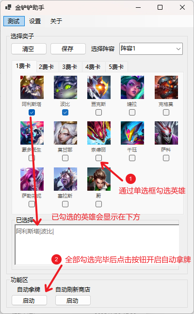
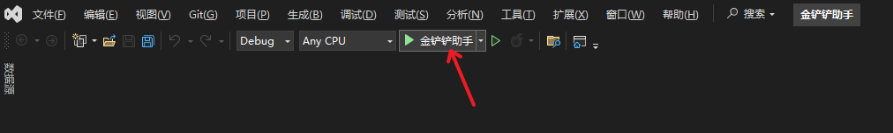
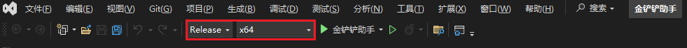
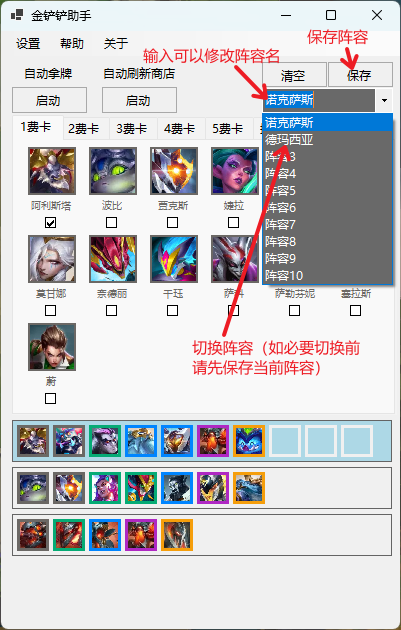
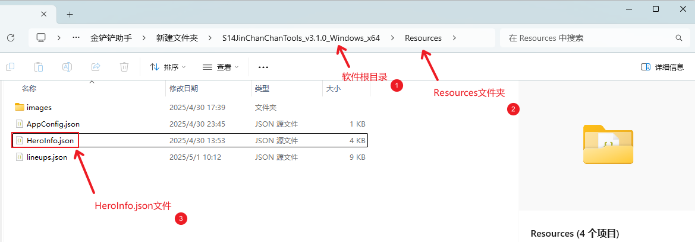
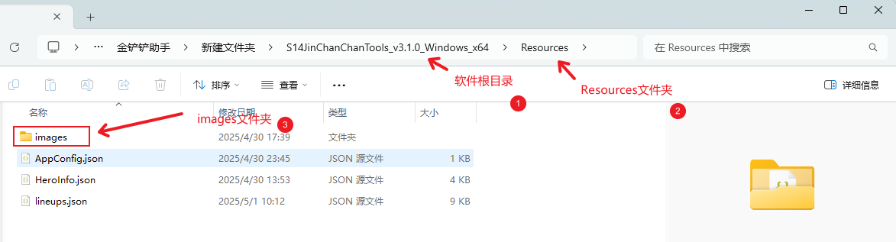

# 开发者文档

   1.1 [获取项目源码文件](#获取项目源码文件)

   1.2 [开发环境配置](#开发环境配置)

   1.3 [项目结构](#项目结构)

   1.4 [运行项目](#运行项目)

   1.5 [构建应用](#构建应用)

   1.6 [常见问题](#常见问题)

   1.7 [项目引用](#项目引用)


## 获取项目源码文件

### 方式1

1. 前往[Release 页面](https://github.com/XJYdemons/Jin-chan-chan-Tools/releases) 下载最新的源码`JinChanChanTool_vx.x.x_SourceCode.zip`。
2. 下载压缩包文件后，解压到一个目录中。

### 方式2

1. 项目-Code-DownLoad ZIP下载压缩包。
2. 解压后，源码文件存放于SourceCode文件夹中。



## 开发环境配置

* IDE：Visual Studio 2022
* 必需组件：
  * .NET 8.0 SDK
  * Windows SDK


## 项目结构

 ```
├── /JinChanChanTool                             # 项目文件夹
	├── /bin                                     # 编译后的输出目录
	├── /DataClass                               
		├── AppConfig.cs                         # 应用设置数据类
		├── HeroData.cs                          # 单个英雄数据类
		├── LineUp.cs                            # 单个阵容数据类
		├── Peculiarity.cs                       # 单个特质数据类
		├── Profession.cs                        # 单个职业数据类
		└── ResultMapping.cs                     # 单个OCR结果纠正数据类
	├── /DIYComponents
		└── HeroPictureBox.cs                    # 自定义的PictureBox，支持边框粗细与颜色调整。
	├── /obj                                     # 中间文件目录，包含编译时生成的临时文件
	├── /Properties                              # 项目属性文件夹
	├── /Resources                               # 资源目录
		├── /HeroDatas                           # 存放英雄数据文件
		├── /Models                              # 存放GPU推理OCR所使用的模型
		├── CorrectionsList.json                 # OCR结果纠正文件
		├── defaultHeroIcon.png                  # 默认英雄图片
		└── icon.ico                             # 软件图标
	├── /Services
		├── /DataServices
			├── AppConfigService.cs              # 应用设置数据服务类
			├── CorrectionService.cs             # OCR结果纠正数据服务类
			├── HeroDataService.cs               # 英雄数据服务类
			├── IAppConfigService.cs             # 应用设置数据服务接口
			├── ICorrectionService.cs            # OCR结果纠正数据服务接口
			├── IHeroDataService.cs              # 英雄数据服务接口
			├── ILineUpService.cs                # 阵容数据服务接口
			└── LineUpService.cs                 # 阵容数据服务类
		├── CardService.cs                       # 拿牌服务类
		├── FastSettingPositionService.cs        # 快速设置截图坐标与刷新商店坐标服务类
		└── UIBuilderService.cs                  # UI构建服务类
	├── /Tools
		├── /KeyBoardTools                       # 键盘工具类
			├── GlobalHotkeyTool.cs              # 全局快捷键工具类
			└── KeyboardControlTool.cs           # 键盘模拟操作工具类			
        ├── /LineUpCodeTools                     # 阵容码工具类
        	├── LineUpParser.cs                  # 云顶之弈阵容码工具类
			└── MobileLineUpParser.cs            # 金铲铲之战阵容码工具类
        ├── /MouseTools # 鼠标工具类 
        	├── MouseControlTool.cs              # 鼠标模拟操作工具类        
        	├── MouseHookTool.cs                 # 鼠标监听工具类
			└── MousePositionTool.cs             #鼠标坐标工具类
        ├── /OCRTools # OCR工具类
        	├── CPU_OCRTool.cs                   # CPU推理OCR工具类  	
			└── GPU_OCRObject.cs                 # GPU推理OCR工具类	
        ├── ImageProcessingTool.cs               # 截图及处理工具类
        └── LogTool.cs                           # 日志工具类
	├── app.manifest                             # 应用配置清单文件
	├── JinChanChanTool.csproj                   # 项目文件，用于描述 C# 项目
	├── JinChanChanTool.csproj.user              # 用户特定的项目配置文件
	└── Program.cs                               # 应用程序入口点
└── JinChanChanTool.sln                          # 解决方案文件，可通过VisualStudio打开。
 ```
## 运行项目

1. 使用 Visual Studio 打开 JinChanChanTool.sln 文件。

2. 选择`Debug-X64`模式，如图：
    

3. 点击运行，如图：

    

## 构建应用

1. 使用 Visual Studio 打开金铲铲助手.sln 文件。
2. 选择`Release-X64`模式，如图：



3. 点击 **生成** > **生成解决方案**。如图：



4. 构建的可执行文件将保存在 bin\x64\Release\net8.0-windows10.0.17763.0 文件夹下。


## 常见问题

**问题1：** 运行或生成解决方案时报错：无法处理文件 Form1.resx，因为它位于 Internet 或受限区域中，或者文件上具有 Web 标记。要想处理这些文件，请删除 Web 标记。如图：



**解决：**

1. 先关闭VisualStudio。
2. 来到项目根目录，找到文件“Form1.resx”，右键菜单-属性。
3. 在下方“安全”-“此文件来自其他计算机，可能被阻止以帮助保护该计算机”处，勾选“解除锁定”，并点击应用按钮。如图：



4. 再次用VisualStudio打开金铲铲助手.sln 文件。


## 项目引用
* [Paddle OCR Sharp](https://github.com/raoyutian/PaddleOCRSharp)
* [PaddleSharp](https://github.com/sdcb/PaddleSharp)

